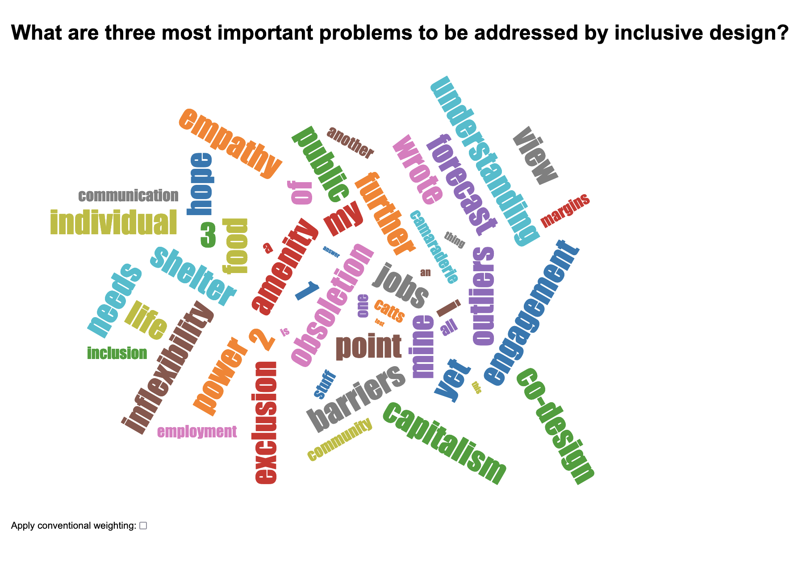

In a traditional word cloud, the most popular answers (e.g. words, phrases) are emphasized. The result of this emphasis
is for the minority to fade away into the background. With their work on Inverted Wordles, the We Count team is seaking
a way to invert that relationship and provide a means to amplify those minority voices.

<figure>
    
    <figcaption>
        

            

                A screenshot showing a wordle generated for the question, "What are the three most important problems to
                be addressed by inclusive design?"
            

            Answers include:
            <ul>
                <li>hope</li>
                <li>engagement</li>
                <li>power</li>
                <li>empathy</li>
                <li>co-design</li>
                <li>captitalism</li>
                <li>needs</li>
                <li>shelter</li>
                <li>barriers</li>
                <li>outliers</li>
                <li>inflexibility</li>
                <li>communication</li>
                <li>margins</li>
                <li>etc.</li>
            </ul>
        

    </figcaption>
</figure>

For more details, see ["Inverted Wordles"](https://wecount.inclusivedesign.ca/views/inverted-wordles/) on
[We Count's website](https://wecount.inclusivedesign.ca).
